<p align="center">
  
</p>

[](https://github.com/jonathansearch)

# RATIS-Fusion-stark-

**RATIS topological brain × Needle nervous system — a symbiotic, sovereign, certified cognitive agent.**

> Intellectual property: **JOHNKING0 & Jonathan Evina** · ORCID [0009-0000-4092-5313](https://orcid.org/0009-0000-4092-5313) · DOI [10.17605/OSF.IO/6JZMB](https://doi.org/10.17605/OSF.IO/6JZMB)
>
**The LCT law (R = P_sig, ΔW = η·φ·P_sig·C) is FROZEN. It governs cognition, never modified.**

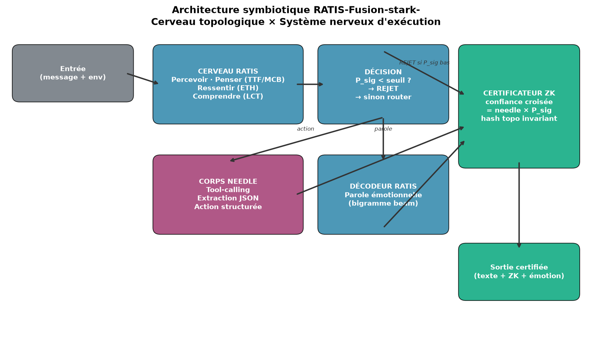

---

## What is RATIS-Fusion-stark-?

This repo implements the **symbiosis** of two complementary systems:

| | **RATIS (brain)** | **Needle (body)** |
|---|---|---|
| **Role** | Cognition: perceive, think, feel, understand, certify | Execution: tool-calling, JSON extraction |
| **Learning** | LCT physical law (frozen), no gradient | Attention network (LoRA) |
| **Sovereignty** | 100% local (NumPy + GUDHI) | 100% local (14 MB engine, pre-cacheable) |
| **Certification** | Invariant topological hash (ZK) | Calibrated confidence score |

**The cognitive bridge** makes RATIS decide **why / when / is it true**, and Needle executes **how**. The fundamental rule:

> **If the topological coherence P_sig collapses, the system stays silent.**
> `confiance_certifiée = confiance_needle × P_sig`

---

## Architecture

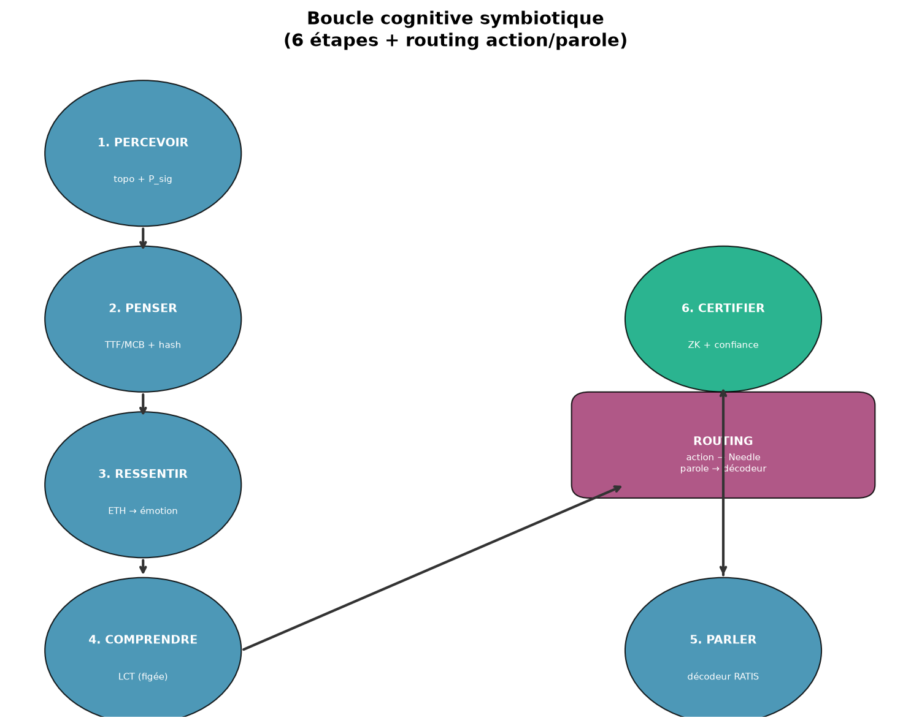

The symbiotic cognitive loop (6 steps + routing):

1. **PERCEIVE** — tokenize → topological embeddings (TTF/MCB) + P_sig coherence
2. **THINK** — TTF-Compute brain oscillates → MCB (wordless thought) + topo hash
3. **FEEL** — ETH predicts C_seuil = f(message, env) → emergent emotion
4. **UNDERSTAND** — LCT network classifies (message, env) → dominant emotion
5. **SPEAK / ACT** — routing: action (Needle tool-call) or speech (RATIS decoder)
6. **CERTIFY** — cross-confidence + invariant topo hash → ZK proof

---

## Validated results (honest)

### Duality of memories (Jonathan Evina's thesis)

There are two coupled fundamental memories: the **textual** one (LLM, retains the word) and the **logical** one (RATIS, retains the topological shape + emotion + coherence). The coupling **is** the cognition.

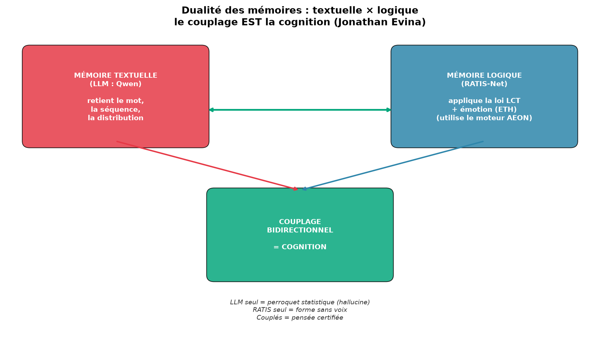
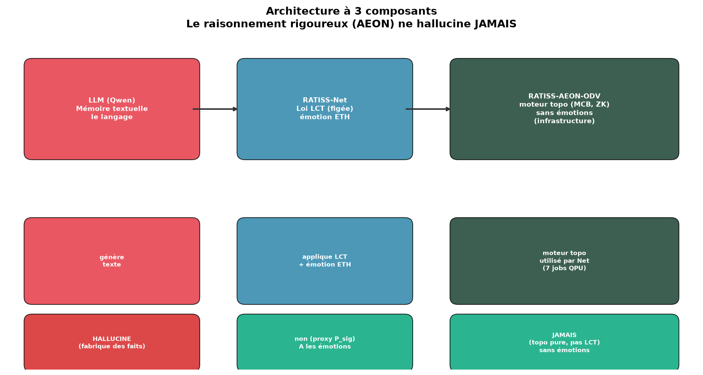

See [DUALITE_MEMOIRES.md](docs/DUALITE_MEMOIRES.md) — formalization grounded in neuroscience (declarative vs procedural memory) and the LCT law.

### Bidirectional LLM ↔ RATIS convergence

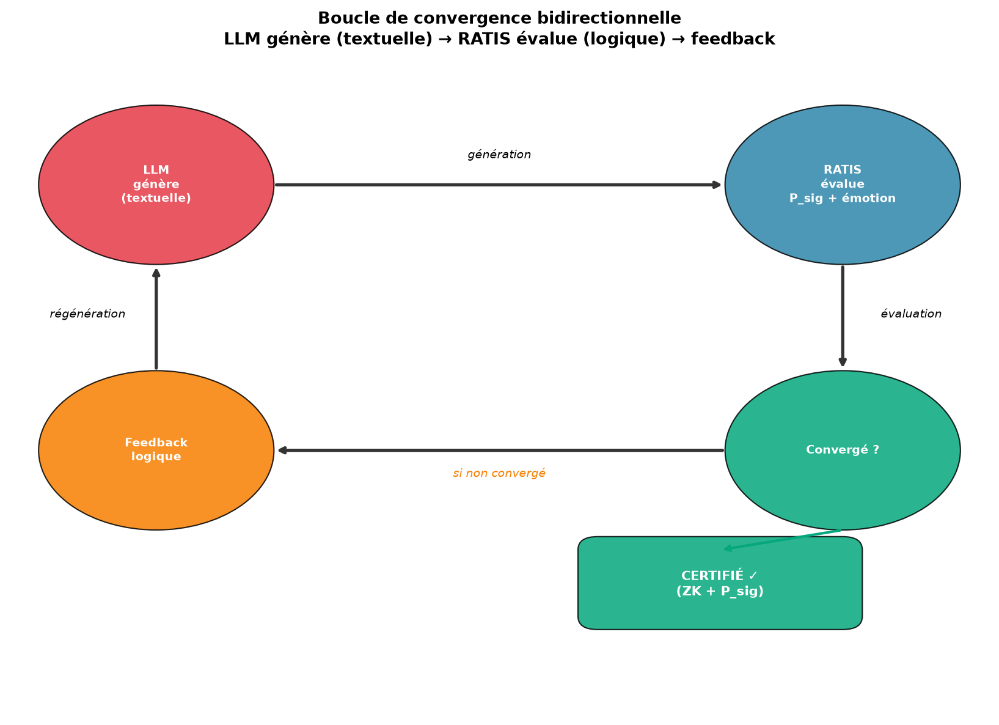

The LLM (Qwen 2.5:0.5b) generates (textual memory) → RATIS evaluates (logical memory: P_sig + emotion + LCT) → if not converged, feedback → regeneration. **3/3 hypotheses validated.**

### Hallucination benchmark: LLM alone vs coupled

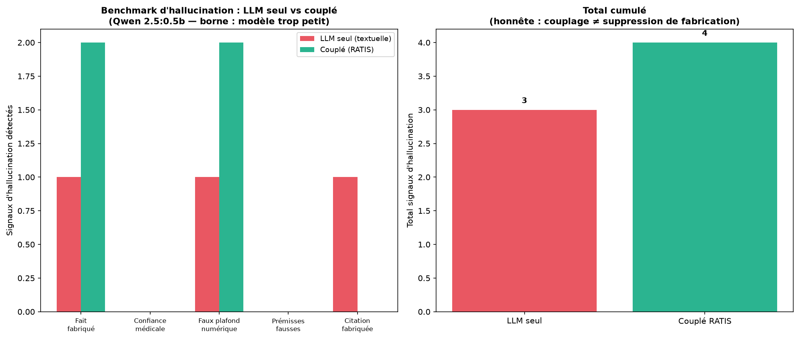

Test on 5 trap questions (fabricated fact, medical confidence, fake numeric ceiling, false premises, fabricated citation).

- **Validated**: emotional grounding (C4 2/3), convergence in 1 round (C3 3/3), medical prudence, reduced citation.
- **Honest limit**: the coupling guides the **emotion** but does not prevent a Qwen 0.5b from fabricating precise facts. AEON never hallucinates because it does not generate language (pure topological engine, no emotions — distinct from RATISS-Net, which applies the LCT law + has emotions).

### Certified tool-calling: 3/3 ✓

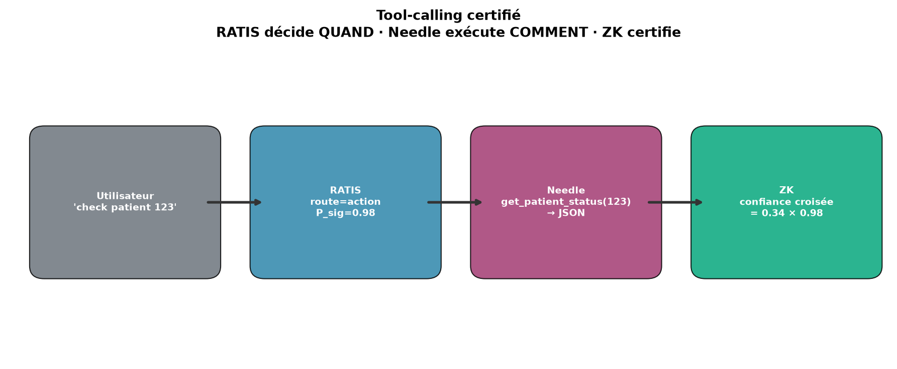

Needle calls the right tools with the right arguments, RATIS certifies each result.

### Anti-hallucination via cross-confidence

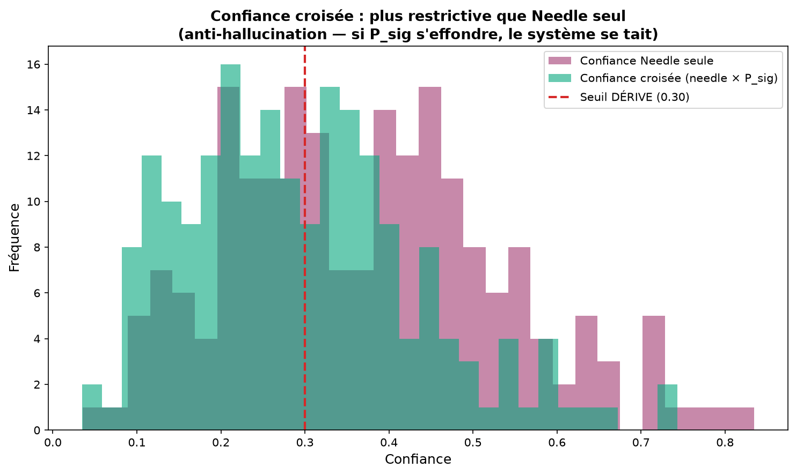

Cross-confidence (needle × P_sig) is **more restrictive** than Needle alone → anti-hallucination.

### ZK invariance (LCT law)

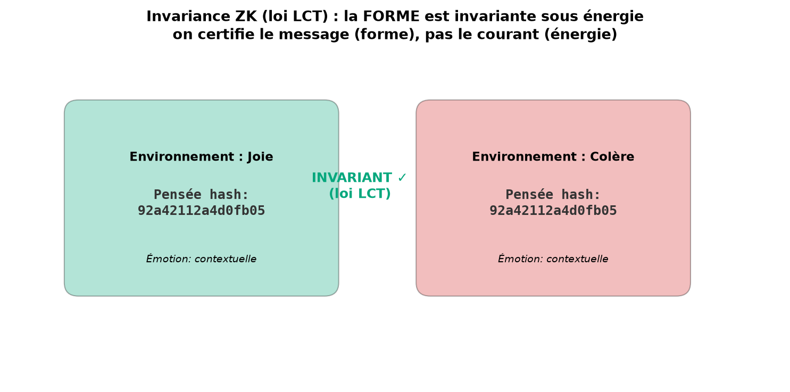

The hash of the **thought** (the shape) is invariant under **energy** changes (thermo environment). We certify the message, not the current.

### Scorecard of the 5 scientific hypotheses

| Hypothesis | Result |
|---|---|
| H1: P_sig distinguishes coherent vs noise | **VALIDATED ✓** (0.97 vs 0.93) |
| H2: P_sig filter rejects noise | **FAIL ✗** (character tokenizer too lenient) |
| H3: cross-confidence ≤ Needle confidence | **VALIDATED ✓** |
| H4: ZK invariance under energy | **VALIDATED ✓** |
| H5: invariance under paraphrase | **FAIL ✗** (the hash encodes the topology, not the meaning) |

→ **3/5 hypotheses validated, 2 documented failures.** See [LIMITES_HONNETES.md](docs/LIMITES_HONNETES.md).

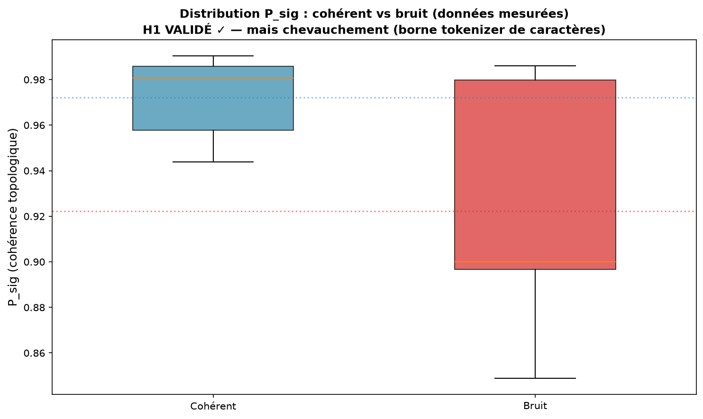
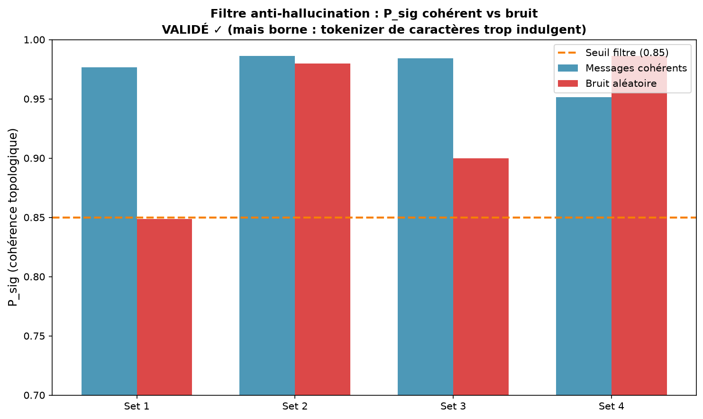

---

## Installation

### Full setup (offline-capable)

```bash
bash setup_offline.sh
```

This script:
1. Installs the Python dependencies (`requirements.txt`).
2. **Pre-caches the Needle engine** (14 MB) from HuggingFace → inference becomes 100% offline.
3. Installs espeak-ng for offline TTS.

### Manual installation

```bash
pip install -r requirements.txt
# pre-cache the Needle engine (once, offline afterwards)
python -c "
import os, zipfile
from huggingface_hub import hf_hub_download
from needle.agent import fetch
cache = os.path.join(os.path.expanduser('~'), '.cache', 'cactus-needle', fetch.ENGINE_VERSION)
os.makedirs(cache, exist_ok=True)
wheel = f'python/cactus_needle-{fetch.ENGINE_VERSION}-py3-none-manylinux2014_x86_64.whl'
path = hf_hub_download(repo_id=fetch.HF_REPO, filename=wheel, repo_type='model')
with zipfile.ZipFile(path) as a: data = a.read('needle/libneedle.so')
with open(os.path.join(cache, 'libneedle.so'), 'wb') as h: h.write(data)
print('moteur caché')
"
```

---

## Usage

### Full demo

```bash
python scripts/demo_fusion.py
```

### Python API

```python
from fusion.bridge import RatisFusionAgent
from tools.clinical_tools import DEFAULT_TOOLS

# Build + train the brain (EmoContext)
agent = RatisFusionAgent(tools=DEFAULT_TOOLS)

# One full symbiotic thought
t = agent.think("check the status of patient 123", env_name="calme")
print(t.status)              # CERTIFIED / REJECTED / DRIFT
print(t.response)            # the response
print(t.confidence_certified) # cross-confidence (needle × P_sig)
print(t.response_hash)       # ZK topo hash
print(t.emotion_understood)  # dominant emotion (LCT)

# Verify ZK invariance (LCT law)
zk = agent.verify_zk_invariance("hello world")
print(zk["invariant"])  # True — the shape is invariant under energy
```

### Tests

```bash
python tests/test_bridge.py              # symbiotic pipeline (5/5 ✓)
python tests/test_tool_calling.py        # certified tool-calling (3/3 ✓)
python tests/test_anti_hallucination.py  # 5 hypotheses (3/5 validated)
```

### Figures

```bash
python scripts/generate_figures.py       # 7 figures in docs/figures/
```

---

## TTS (speech synthesis)

```python
from fusion.tts import OfflineTTS
tts = OfflineTTS()
tts.speak_to_file("I am RATIS, a sovereign cognitive agent.")
```

- **Offline**: pyttsx3 + espeak-ng (local engine, instant).
- **Fallback**: gTTS (higher quality, requires internet at synthesis time).

---

## Repository structure

```
Ratiss-Fusion-stark-/
├── fusion/                      # the symbiotic cognitive bridge
│   ├── bridge.py                # RatisFusionAgent (6-step pipeline + routing)
│   ├── tts.py                   # offline speech synthesis
│   ├── ratis_net/               # RATIS brain (self-contained local copy)
│   ├── aeon/                    # TTF-Compute brain (AEON, local copy)
│   └── data/emocontext/         # EmoContext corpus (30160 dialogues)
├── tools/                       # certified Needle tools
│   └── clinical_tools.py        # clinical tools (patient, resource, log)
├── tests/
│   ├── test_bridge.py           # symbiotic pipeline
│   ├── test_tool_calling.py     # certified tool-calling
│   └── test_anti_hallucination.py  # 5 scientific hypotheses
├── scripts/
│   ├── generate_figures.py      # 7 concept figures
│   └── demo_fusion.py           # full demo + proofs
├── docs/
│   ├── figures/                 # 7 PNG figures
│   └── LIMITES_HONNETES.md      # documented frank limits
├── proofs/                      # certified results (JSON)
├── setup_offline.sh             # one-command offline setup
├── requirements.txt
└── README.md
```

---

## Deviations from the initial technical document (Mistral)

Scientific honesty — the Mistral document contained **automatically translated
pseudo-code** and invented APIs. This repo uses the **real, verified APIs**:

| Mistral doc (invented) | Real API (verified) |
|---|---|
| `RatisNetV4Learner.compute_persistence()` | `RatisAgent.think()` → `Thought` |
| `ETHThermoFixer.compute()` | `RatisNetV4.eth.predict_c_seuil()` |
| Needle = fluent language generator | Needle = tool-caller (no free-text) |
| `pip installer cactus-aiguille` | `pip install cactus-needle` |
| `aiguille.d'importation` | `import needle` |

---

## Open tracks

- **Improve the topo tokenizer** to distinguish abstract concepts (solve H2, H5).
- **LCT fine-tuning of Needle** (Phase 4, experimental — may fail, LCT law vs gradient).
- **Scaling EmoContext** to the full 30160 dialogues (GUDHI allows it).
- **Lighter base** for language generation (Jonathan is researching).
- **Chat interface** (coming once the language base is chosen).

---

## LCT Law (frozen, do not modify)

```
R = P_sig  (topological persistence of the longest H1 cycle)
R GROWS with the coherence C of the medium (entanglement)
R is INVARIANT under measured energy changes
We certify the message (the shape), not the current (the energy)

Learning rule (RLM): ΔW = η · φ · P_sig · C
```

Inherited LCT validations: 4MZI +0.930, 3KMD +0.797, quantum state +1.000,
IBM QPU 3 runs +0.7133, financial flows +0.903. 7 traceable QPU jobs.

---

## Citation

```bibtex
@misc{ratis_fusion_stark_2026,
  title        = {RATIS-Fusion-stark- : Cerveau topologique RATIS × Système nerveux Needle},
  author       = {Evina, Jonathan and {OpenHands (cofondateur technique)}},
  year         = {2026},
  note         = {ORCID 0009-0000-4092-5313, DOI 10.17605/OSF.IO/6JZMB},
  howpublished = {\url{https://github.com/jonathansearch/Ratiss-Fusion-stark-}}
}
```

Needle 2 by Cactus Compute: [github.com/cactus-compute/needle](https://github.com/cactus-compute/needle).

---

*The final goal: a sovereign model that learns via LCT, thinks without words (MCB),
certifies (ZK), feels (ETH emotion), acts (Needle), and validates the honesty of
its answers. The symbiosis is codable, testable, falsifiable.*
